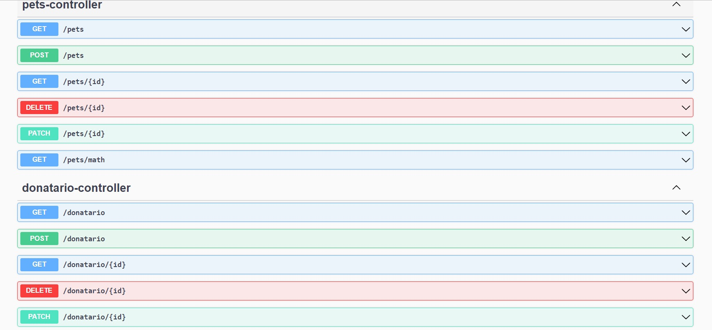

<h1> becaDesafioGreaziel</h1>

> Status: Developing ⚠️

### Project made by me for the entry of the beca challenge in Java.

#### This is a web application with the aim of matching donated pets with people who want to adopt.

## Some fields in Person model is

+ id
+ nome
+ cep
+ logradouro

## Also that, mas a Pets with this fields:

+ id
+  proprietario
+  nome
+  raca

## Technologies used

<table>
  <tr>
    <td>Tecnologies</td>
    <td>Version</td>
  </tr>
  
  <tr>
    <td>Java</td>
    <td>11</td>
  </tr>
   <tr>
    <td>Spring Boot</td>
    <td>2.6</td>
  </tr>
</table>

## Class diagram

## In challenge two it was implemented:

+ package controllers

### Some end points

## In challenge three it was implemented:

+ package serices
+ AdocaoService
+ DoadorService
+ DonatarioService
+ PetsService

## In challenge four it was implemented:

+ package repositorys
+ AdocaoRepository
+ DoadorRepository
+ DonatarioRepository
+ PetsRepository

The integration with the database and the remodeling of the controllers classes were also carried out.

## In to challenge five it was implemented:

the dto package is applied to the dtos concept. Encapsulation was made in the information for greater security of the application

## In to challenge six it was implemented:

+ Mappers
+ Lombok
+ JSR

## In to challenge seven it was implemented:

Error handling has been done