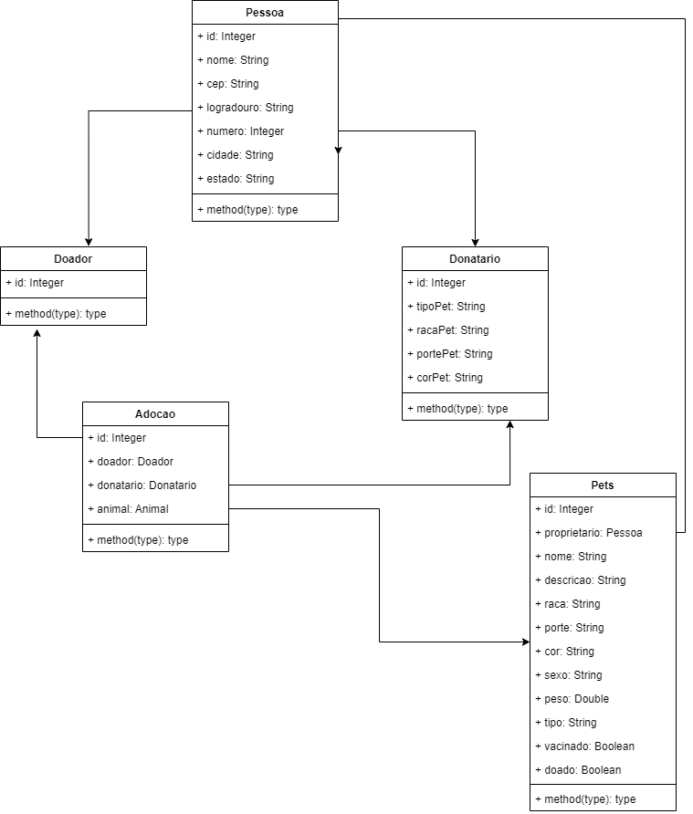

<h1> becaDesafioGreaziel</h1>

> Status: Developing ⚠️

### Project made by me for the entry of the beca challenge in Java.

#### This is a web application with the aim of matching donated pets with people who want to adopt.

## Some fields in Person model is

+ id
+ nome
+ cep
+ logradouro

## Also that, mas a Pets with this fields:

+ id
+  proprietario
+  nome
+  raca

## Technologies used

<table>
  <tr>
    <td>Tecnologies</td>
    <td>Version</td>
  </tr>
  
  <tr>
    <td>Java</td>
    <td>11</td>
  </tr>
   <tr>
    <td>Spring Boot</td>
    <td>2.6</td>
  </tr>
</table>

## Class diagram

